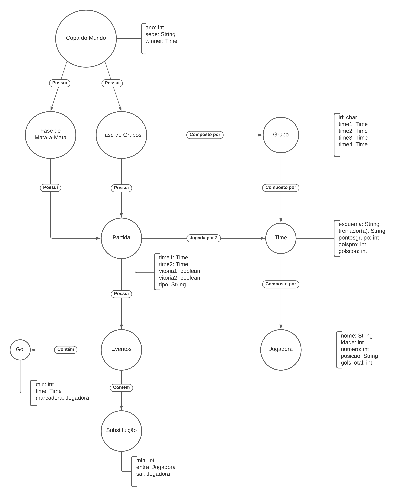

# Aluno
* 200025: José Augusto Nascimento Afonso Marcos

## Modelo Lógico do Banco de Dados de Grafos

> 

## Perguntas de Pesquisa/análise

> Liste aqui as três perguntas de pesquisa/análise
> * Pergunta 1
> * Pergunta 2
> * Pergunta 3