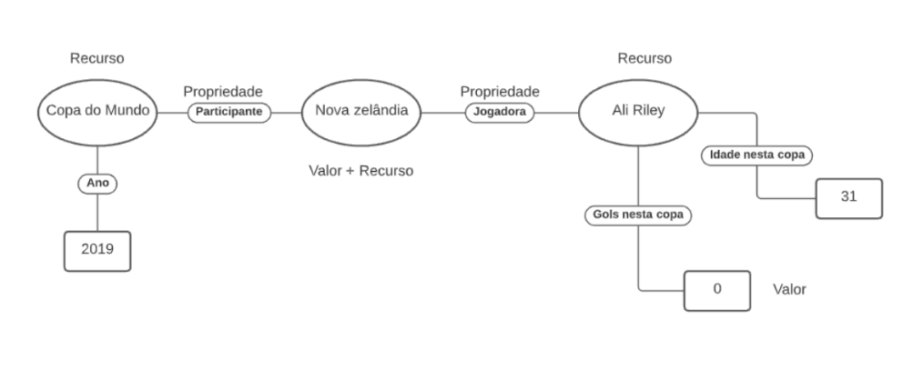

## Exemplo de Grafo de Conhecimento - para publicar ou enriquecer

> 

> Nosso banco de dados poderia ser facilmente transformado em um grafo de conhecimento seguindo o esquema básico: Recurso --> Propriedade --> Valor. Podemos fazer esse tipo de grafo pois os dados do nosso banco de dados são altamente hierarquizados, onde muitos dos dados de cada nó apontam para outros nós seguindo uma propriedade expecífica (por exemplo Time -> Joga -> Jogadora), o que de fato é a aplicação de um valor sendo usado novamente como um recurso. Usando a dbpedia como exemplo, poderíamos também transformar nosso grafo em um esquema com N-Triples, com links para cada um dos atributos até chegarmos em atributos primitivos (como número de gols, idade da jogadora, que são inteiros por exemplo) que não necessitam de links, sendo tratados somente como valor. Abaixo está um exemplo real, onde o grafo é montado utilizando valores como recursos até atingir os gols da jogadora, representados com um tipo primitivo (inteiro).

> 

## Perguntas de Pesquisa ou Queries

> Pergunta 1
> * Qual foi a jogadora que mais marcou gols pela seleção X no ano Y?

> Query 2 
> * Encontrar todas as jogadoras com mais de X anos de idade que atuaram na copa Y: //ano=Y/seleções/jogadoras[age > X]

> Pergunta 3
> * Quantos jogos tiveram vencedores que ganharam de virada? (no exemplo não é mostrado, mas as partidas podem ter a propriedade gol, que contém o tempos de marcação como valor).